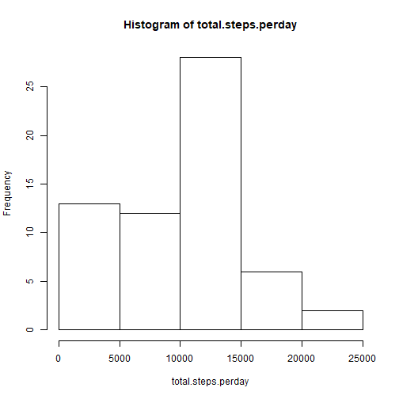
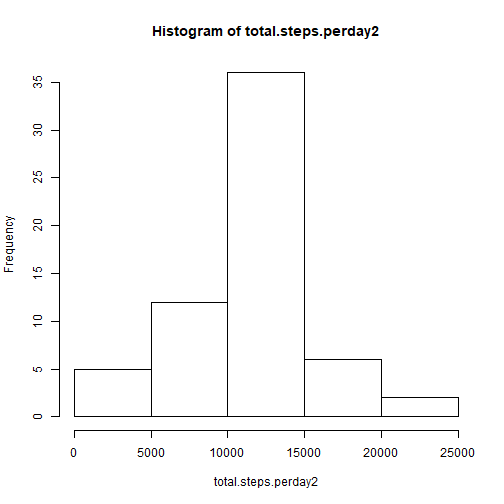
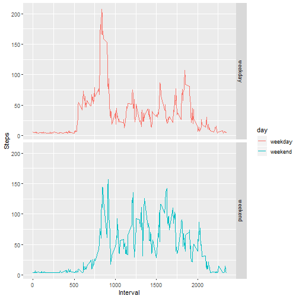

Title: "Reproducible Research Project 1"
==========================================
The data for this assignment can be downloaded from the course web site:

Dataset: [Activity monitoring data [52K]](https://d396qusza40orc.cloudfront.net/repdata%2Fdata%2Factivity.zip)

The variables included in this dataset are:

* steps: Number of steps taking in a 5-minute interval (missing values are coded as \color{red}{\verb|NA|}NA)
* date: The date on which the measurement was taken in YYYY-MM-DD format
* interval: Identifier for the 5-minute interval in which measurement was taken

Set global options - show r code 

```r
library(ggplot2)
library(knitr)
opts_chunk$set(echo=TRUE)
```

#1. Code for reading in the dataset and/or processing the data

```r
activity<-read.csv("./activity/activity.csv")
head(activity)
```

```
##   steps       date interval
## 1    NA 2012-10-01        0
## 2    NA 2012-10-01        5
## 3    NA 2012-10-01       10
## 4    NA 2012-10-01       15
## 5    NA 2012-10-01       20
## 6    NA 2012-10-01       25
```

```r
str(activity)
```

```
## 'data.frame':	17568 obs. of  3 variables:
##  $ steps   : int  NA NA NA NA NA NA NA NA NA NA ...
##  $ date    : Factor w/ 61 levels "2012-10-01","2012-10-02",..: 1 1 1 1 1 1 1 1 1 1 ...
##  $ interval: int  0 5 10 15 20 25 30 35 40 45 ...
```

```r
summary(activity)
```

```
##      steps                date          interval     
##  Min.   :  0.00   2012-10-01:  288   Min.   :   0.0  
##  1st Qu.:  0.00   2012-10-02:  288   1st Qu.: 588.8  
##  Median :  0.00   2012-10-03:  288   Median :1177.5  
##  Mean   : 37.38   2012-10-04:  288   Mean   :1177.5  
##  3rd Qu.: 12.00   2012-10-05:  288   3rd Qu.:1766.2  
##  Max.   :806.00   2012-10-06:  288   Max.   :2355.0  
##  NA's   :2304     (Other)   :15840
```
Process/transform the data (if necessary) into a format suitable for your analysis

```r
#convert date from factor to date format
activity$date<-as.Date(activity$date, format = "%Y-%m-%d")
head(activity)
```

```
##   steps       date interval
## 1    NA 2012-10-01        0
## 2    NA 2012-10-01        5
## 3    NA 2012-10-01       10
## 4    NA 2012-10-01       15
## 5    NA 2012-10-01       20
## 6    NA 2012-10-01       25
```

```r
str(activity)
```

```
## 'data.frame':	17568 obs. of  3 variables:
##  $ steps   : int  NA NA NA NA NA NA NA NA NA NA ...
##  $ date    : Date, format: "2012-10-01" "2012-10-01" ...
##  $ interval: int  0 5 10 15 20 25 30 35 40 45 ...
```
#2. Histogram of the total number of steps taken each day

```r
total.steps.perday<-with(activity,tapply(steps, date, sum, na.rm=T))
str(total.steps.perday)
```

```
##  int [1:61(1d)] 0 126 11352 12116 13294 15420 11015 0 12811 9900 ...
##  - attr(*, "dimnames")=List of 1
##   ..$ : chr [1:61] "2012-10-01" "2012-10-02" "2012-10-03" "2012-10-04" ...
```

```r
hist(total.steps.perday)
```



```r
mean.daily.steps<-as.integer(mean(total.steps.perday))
median.daily.steps<-median(total.steps.perday)
print(mean.daily.steps)
```

```
## [1] 9354
```

```r
print(median.daily.steps)
```

```
## [1] 10395
```
#3. Mean and median number of steps taken each day

```r
mean.steps.perday<-as.integer(mean(total.steps.perday, na.rm=T))
print(mean.steps.perday)
```

```
## [1] 9354
```

```r
median.steps<-as.integer(median(total.steps.perday, na.rm=T))
print(median.steps)
```

```
## [1] 10395
```
#4. Time series plot of the average number of steps taken
Make a time series plot (i.e. \color{red}{\verb|type = "l"|}type="l") of the 5-minute interval (x-axis) and the average number of steps taken, averaged across all days (y-axis)

```r
library(dplyr,quietly = TRUE)
library(ggplot2)
avg.steps<- tapply(activity$steps, activity$interval, mean, na.rm = TRUE)
avg.steps.table<-data.frame(interval=as.numeric(names(avg.steps)), avg.steps=as.integer(avg.steps))
p <- ggplot(avg.steps.table, aes(x=interval, y=avg.steps), xlab = "Interval", ylab="Average Number of Steps")
p + geom_line(color="blue")+xlab("Interval")+ylab("Average Number of Steps")+ggtitle("Average Steps Per Interval")
```


#5. The 5-minute interval that, on average, contains the maximum number of steps
Which 5-minute interval, on average across all the days in the dataset, contains the maximum number of steps?

```r
max.steps<-max(avg.steps.table$avg.steps)
max.interval<-avg.steps.table[avg.steps.table$avg.steps==max.steps, 1]
print(max.interval)
```

```
## [1] 835
```
#6. Code to describe and show a strategy for imputing missing data
first, check the amount of missing values

```r
activity<-read.csv("./activity/activity.csv")
missing.steps<-sum(is.na(activity$steps))
print(missing.steps)
```

```
## [1] 2304
```

```r
missing.pct<-mean(is.na(activity$steps))
print(missing.pct)
```

```
## [1] 0.1311475
```
Strategy: use mean step per interval of that day for imputation

```r
library(dplyr)
activity<-read.csv("./activity/activity.csv")
activity$date<-as.Date(activity$date, format = "%Y-%m-%d")
```

Create data frame of mean interval steps by date

```r
meandf <- activity %>%
  group_by(date) %>%
  summarise_at(vars(-interval), funs(mean(., na.rm=TRUE)))
```

There are 8 days missing steps data. Use mean daily interval steps (37) to replace

```r
meandf$steps[which(is.na(meandf$steps))]<-mean(meandf$steps, na.rm=TRUE)
meandf$steps<-as.integer(meandf$steps)
names(meandf) <-c("date", "meansteps")
meandf
```

```
## # A tibble: 61 x 2
##    date       meansteps
##    <date>         <int>
##  1 2012-10-01        37
##  2 2012-10-02         0
##  3 2012-10-03        39
##  4 2012-10-04        42
##  5 2012-10-05        46
##  6 2012-10-06        53
##  7 2012-10-07        38
##  8 2012-10-08        37
##  9 2012-10-09        44
## 10 2012-10-10        34
## # ... with 51 more rows
```

Merge activity with mean steps information, and replace missing values with mean steps per interval for that date

```r
activity2<-merge(activity, meandf, by="date", all.x=TRUE)
activity2$steps[which(is.na(activity$steps))]<-activity2$meansteps[which(is.na(activity$steps))]
```
#7. Histogram of the total number of steps taken each day after missing values are imputed

```r
total.steps.perday2<-with(activity2,tapply(steps, date, sum, na.rm=T))
hist(total.steps.perday2)
```



```r
mean.daily.steps<-as.integer(mean(total.steps.perday2))
median.daily.steps<-median(total.steps.perday2)
print(mean.daily.steps)
```

```
## [1] 10751
```

```r
print(median.daily.steps)
```

```
## [1] 10656
```

original data (with NA), mean daily step: 10766               median daily steps: 10765
After imputation:        mean daily step: 10751               median daily steps: 10656

#8. Panel plot comparing the average number of steps taken per 5-minute interval across weekdays and weekends

```r
library(lubridate)
activity2$daytype <- ifelse(wday(activity2$date, label=TRUE) == "Sat" | wday(activity2$date,label=TRUE) == "Sun", "weekend", "weekday")

#average steps per interval for weekdays
avgsteps.weekday <- tapply(activity2[activity2$daytype == "weekday",]$steps, activity2[activity2$daytype == "weekday" ,]$interval, mean, na.rm = TRUE)

#average steps per interval for weekends
avgsteps.weekend <- tapply(activity2[activity2$daytype == "weekend" ,]$steps, activity2[activity2$daytype == "weekend" ,]$interval, mean, na.rm = TRUE)

intervals<-as.numeric(names(avgsteps.weekday ))
stepwkday<-data.frame(Interval=as.numeric(intervals), Steps=as.integer(avgsteps.weekday), day=rep("weekday", length(intervals)))
stepwkend<-data.frame(Interval=as.numeric(intervals), Steps=as.integer(avgsteps.weekend), day=rep("weekend", length(intervals)))
steps.df<-rbind(stepwkday, stepwkend)

qplot(Interval, Steps, data=steps.df, facets=day~., geom=c("line"), color=day)
```



